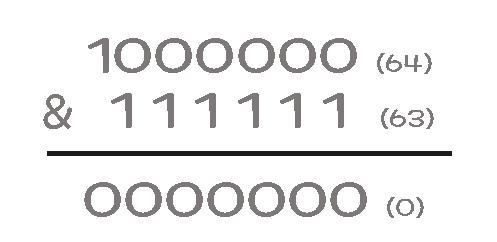

#   Lv2

-   게임 맵 최단거리
    -   0-1 BFS
-   JadenCase 문자열 만들기
    -   toupper(char): 대문자 변환
    -   tolower(char): 소문자 변환
- 땅따먹기
    -  여러개 최댓값 max({1,2,3,4,5});
    -  여러개 최솟값 min({1,2,3,4,5}); 
    - **{} 로 묶어주는게 포인트**
- 영어 끝말잇기
  - vector 와 string 앞과 뒤 원소 접근
    - v.front(), str.front()
    - v.back(), str.back()
-   점프와 순간 이동
    -   2의 제곱 판단
    - 해당 n과 n-1을 &연산한다   
    

-   N개의 최소공배수
    -   bits/stdc++.h  < numeric >에 최소공배수,최대공약수 함수있음
    -   gcd(a,b) :최대공약수
    -   lcm(a,b) :최소공백수 
    -   두 함수 모두 배개변수 대소 크기는 상관없다

-   교점에 별 만들기.cpp
    -   좌표변환,  음의 인데스 번호를 평행이동하여 양수로 